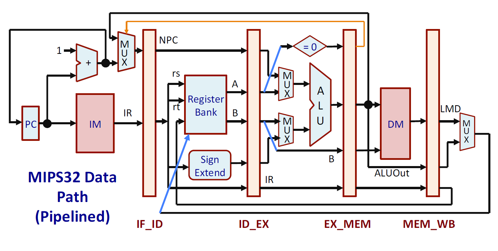

# Design of a 5-Stage Pipelined MIPS32 RISC Processor

This repository documents the design and Verilog implementation of a **MIPS32 Instruction Set Architecture (ISA)-based RISC processor**.  
The processor is built with a **classic 5-stage pipeline**, making it efficient for instruction execution and suitable for academic learning and simulation.

---

## 📑 Table of Contents
- [MIPS32 Overview](#-mips32-overview)
- [Addressing Modes](#-addressing-modes)
- [Supported Instructions](#-supported-instructions)
- [Instruction Encoding](#-instruction-encoding)
- [Execution Stages](#-execution-stages)
- [Non-Pipelined Datapath](#-non-pipelined-datapath)
- [Pipelined Datapath](#-pipelined-datapath)
- [Verilog Design Code](#-verilog-design-code)
- [Testbench and Example Program](#-testbench-and-example-program)
- [Run on EDAPlayground](#-run-on-edaplayground)
- [Known Limitations](#-known-limitations)
- [References](#-references)

---

## 🖥 MIPS32 Overview
- **32 × 32-bit General Purpose Registers (GPRs)**: R0 to R31  
- **Register R0** is hardwired to `0`  
- **32-bit Program Counter (PC)**  
- **No status flags** like carry, zero, or sign  
- **Few addressing modes** for simplicity  
- **Memory is word-addressable** with a 32-bit word size  
- Only **load** and **store** instructions can access memory  

---

## 🧾 Addressing Modes
| Addressing Mode          | Example Instruction     |
|-------------------------|-------------------------|
| Register Addressing     | `ADD R1, R2, R3`        |
| Immediate Addressing    | `ADDI R1, R2, 200`      |
| Base Addressing         | `LW R5, 150(R7)`        |
| PC-Relative Addressing  | `BEQZ R3, LABEL`        |
| Pseudo-Direct Addressing| `J LABEL`               |

---

## 🛠 Supported Instructions
Only a **subset of MIPS32 instructions** is implemented for simplicity.

- Load and Store Instructions  
```
LW R2,124(R8) // R2 = Mem[R8+124]  
SW R5,-10(R25) // Mem[R25-10] = R5  
```
- Arithmetic and Logic Instructions (only register operands)  
```
ADD R1,R2,R3 // R1 = R2 + R3  
ADD R1,R2,R0 // R1 = R2 + 0  
SUB R12,R10,R8 // R12 = R10 – R8  
AND R20,R1,R5 // R20 = R1 & R5  
OR R11,R5,R6 // R11 = R5 | R6  
MUL R5,R6,R7 // R5 = R6 * R7  
SLT R5,R11,R12 // If R11 < R12, R5=1; else R5=0 
```
- Arithmetic and Logic Instructions (immediate operand)  
```
ADDI R1,R2,25 // R1 = R2 + 25  
SUBI R5,R1,150 // R5 = R1 – 150  
SLTI R2,R10,10 // If R10<10, R2=1; else R2=0 
```
- Branch Instructions  
```
BEQZ R1,Loop // Branch to Loop if R1=0  
BNEQZ R5,Label // Branch to Label if R5!=0  
```
- Jump Instruction  
```
J Loop // Branch to Loop unconditionally  
```
- Miscellaneous Instructioon  
```
HLT // Halt execution 
```
### ▫️ Stages of Execution  
The instruction execution cycle in this MIPS32 pipeline follows **five stages**:

1. **IF (Instruction Fetch):** Fetch the instruction from memory.  
2. **ID (Instruction Decode / Register Fetch):** Decode the instruction and read required registers.  
3. **EX (Execution / Effective Address Calculation):** Perform ALU operations or calculate addresses.  
4. **MEM (Memory Access / Branch Completion):** Access data memory or resolve branch instructions.  
5. **WB (Write Back):** Write the result back to the register file.  

> **Note:** Detailed micro-operations are intentionally omitted for simplicity.
## ▫️ Pipelined DataPath  
## Pipelined Datapath

Below is the 5-stage pipelined datapath used in this project:


## ▫️ Verilog Design Code  
``` 
 // ==========================================
// MIPS32 5-Stage Pipelined Processor
// Author: [Your Name or Team Name]
// Description: Implements a basic subset of
// MIPS32 pipeline stages (IF, ID, EX, MEM, WB)
// ==========================================
module mips32_pipeline (clk1, clk2);
    input clk1, clk2;       // Two-phase clock signals

    // ---------- Pipeline Registers ----------
    reg [31:0] PC, IF_ID_IR, IF_ID_NPC;
    reg [31:0] ID_EX_IR, ID_EX_NPC, ID_EX_A, ID_EX_B, ID_EX_Imm;
    reg [2:0]  ID_EX_type, EX_MEM_type, MEM_WB_type;
    reg [31:0] EX_MEM_IR, EX_MEM_ALUOut, EX_MEM_B;
    reg        EX_MEM_cond;
    reg [31:0] MEM_WB_IR, MEM_WB_ALUOut, MEM_WB_LMD;

    // ---------- Register File and Memory ----------
    reg [31:0] Reg [0:31];  // 32 general-purpose registers
    reg [31:0] Mem [0:1023]; // 1K memory words

    // ---------- Opcodes ----------
    parameter ADD=6'b000000, SUB=6'b000001, AND=6'b000010, OR=6'b000011,
              SLT=6'b000100, MUL=6'b000101, HLT=6'b111111,
              LW=6'b001000, SW=6'b001001,
              ADDI=6'b001010, SUBI=6'b001011, SLTI=6'b001100,
              BNEQZ=6'b001101, BEQZ=6'b001110;

    // ---------- Instruction Types ----------
    parameter RR_ALU=3'b000, RM_ALU=3'b001, LOAD=3'b010,
              STORE=3'b011, BRANCH=3'b100, HALT=3'b101;

    // ---------- Control Flags ----------
    reg HALTED;        // Indicates halt state
    reg TAKEN_BRANCH;  // Branch flag

    // ================================
    // IF Stage
    // ================================
    always @(posedge clk1) begin
        if (!HALTED) begin
            if (((EX_MEM_IR[31:26] == BEQZ) && (EX_MEM_cond == 1)) ||
                ((EX_MEM_IR[31:26] == BNEQZ) && (EX_MEM_cond == 0))) begin
                IF_ID_IR  <= #2 Mem[EX_MEM_ALUOut];
                IF_ID_NPC <= #2 EX_MEM_ALUOut + 1;
                PC        <= #2 EX_MEM_ALUOut + 1;
                TAKEN_BRANCH <= #2 1'b1;
            end else begin
                IF_ID_IR  <= #2 Mem[PC];
                IF_ID_NPC <= #2 PC + 1;
                PC        <= #2 PC + 1;
            end
        end
    end

    // ================================
    // ID Stage
    // ================================
    always @(posedge clk2) begin
        if (!HALTED) begin
            ID_EX_A   <= (IF_ID_IR[25:21] == 5'b00000) ? 0 : Reg[IF_ID_IR[25:21]];
            ID_EX_B   <= (IF_ID_IR[20:16] == 5'b00000) ? 0 : Reg[IF_ID_IR[20:16]];
            ID_EX_NPC <= IF_ID_NPC;
            ID_EX_IR  <= IF_ID_IR;
            ID_EX_Imm <= {{16{IF_ID_IR[15]}}, IF_ID_IR[15:0]};

            case (IF_ID_IR[31:26])
                ADD,SUB,AND,OR,SLT,MUL: ID_EX_type <= RR_ALU;
                ADDI,SUBI,SLTI:         ID_EX_type <= RM_ALU;
                LW:                     ID_EX_type <= LOAD;
                SW:                     ID_EX_type <= STORE;
                BNEQZ,BEQZ:             ID_EX_type <= BRANCH;
                HLT:                    ID_EX_type <= HALT;
                default:                ID_EX_type <= HALT; // Unknown op
            endcase
        end
    end

    // ================================
    // EX Stage
    // ================================
    always @(posedge clk1) begin
        if (!HALTED) begin
            EX_MEM_type <= ID_EX_type;
            EX_MEM_IR   <= ID_EX_IR;
            TAKEN_BRANCH <= 0;

            case (ID_EX_type)
                RR_ALU: begin
                    case (ID_EX_IR[31:26])
                        ADD: EX_MEM_ALUOut <= ID_EX_A + ID_EX_B;
                        SUB: EX_MEM_ALUOut <= ID_EX_A - ID_EX_B;
                        AND: EX_MEM_ALUOut <= ID_EX_A & ID_EX_B;
                        OR:  EX_MEM_ALUOut <= ID_EX_A | ID_EX_B;
                        SLT: EX_MEM_ALUOut <= (ID_EX_A < ID_EX_B);
                        MUL: EX_MEM_ALUOut <= ID_EX_A * ID_EX_B;
                        default: EX_MEM_ALUOut <= 32'hXXXXXXXX;
                    endcase
                end
                RM_ALU: begin
                    case (ID_EX_IR[31:26])
                        ADDI: EX_MEM_ALUOut <= ID_EX_A + ID_EX_Imm;
                        SUBI: EX_MEM_ALUOut <= ID_EX_A - ID_EX_Imm;
                        SLTI: EX_MEM_ALUOut <= (ID_EX_A < ID_EX_Imm);
                        default: EX_MEM_ALUOut <= 32'hXXXXXXXX;
                    endcase
                end
                LOAD, STORE: begin
                    EX_MEM_ALUOut <= ID_EX_A + ID_EX_Imm;
                    EX_MEM_B      <= ID_EX_B;
                end
                BRANCH: begin
                    EX_MEM_ALUOut <= ID_EX_NPC + ID_EX_Imm;
                    EX_MEM_cond   <= (ID_EX_A == 0);
                end
            endcase
        end
    end

    // ================================
    // MEM Stage
    // ================================
    always @(posedge clk2) begin
        if (!HALTED) begin
            MEM_WB_type <= EX_MEM_type;
            MEM_WB_IR   <= EX_MEM_IR;

            case (EX_MEM_type)
                RR_ALU, RM_ALU: MEM_WB_ALUOut <= EX_MEM_ALUOut;
                LOAD:           MEM_WB_LMD   <= Mem[EX_MEM_ALUOut];
                STORE: if (!TAKEN_BRANCH) Mem[EX_MEM_ALUOut] <= EX_MEM_B;
            endcase
        end
    end

    // ================================
    // WB Stage
    // ================================
    always @(posedge clk1) begin
        if (!TAKEN_BRANCH) begin
            case (MEM_WB_type)
                RR_ALU: Reg[MEM_WB_IR[15:11]] <= MEM_WB_ALUOut;
                RM_ALU: Reg[MEM_WB_IR[20:16]] <= MEM_WB_ALUOut;
                LOAD:   Reg[MEM_WB_IR[20:16]] <= MEM_WB_LMD;
                HALT:   HALTED <= 1'b1;
            endcase
        end
    end
endmodule

  ```  
## ▫️ Example Program Testbench Code  
Steps:  
1. Initialize register R1 with 10.  
2. Initialize register R2 with 20.  
3. Initialize register R3 with 25.  
4. Add the three numbers and store the sum in R5. 
 
Instructions :  
| Assembly Instruction  | Machine Code | Hexcode |  
| ------------- | ------------- | ------------- |  
| ADDI R1,R0,10  | 001010 00000 00001 0000000000001010  | 2801000a  |  
| ADDI R2,R0,20 | 001010 00000 00010 0000000000010100  | 28020014  |  
| ADDI R3,R0,25 | 001010 00000 00011 0000000000011001  | 28030019  |  
| OR R7,R7,R7 (dummy)| 001010 00000 00011 0000000000011001  | 0ce77800  |  
| OR R7,R7,R7 (dummy)| 001010 00000 00011 0000000000011001  | 0ce77800  |  
| ADD R4,R1,R2 | 000000 00001 00010 00100 00000 000000  | 00222000  |  
| OR R7,R7,R7 (dummy)| 001010 00000 00011 0000000000011001  | 0ce77800 |  
| ADD R5,R4,R3 | 000000 00100 00011 00101 00000 000000  | 00832800  |  
| HLT | 111111 00000 00000 00000 00000 000000  | fc000000  |  

Testbench Code :  
``` 
 // ==========================================
// Testbench for MIPS32 Pipelined Processor
// ==========================================
module test_mips32;
    reg clk1, clk2;
    integer i;
    mips32_pipeline uut (clk1, clk2);

    // Clock generation
    initial begin
        clk1 = 0; clk2 = 0;
        repeat (20) begin
            #5 clk1 = 1; #5 clk1 = 0;
            #5 clk2 = 1; #5 clk2 = 0;
        end
    end

    // Initialize and load program
    initial begin
        for (i=0; i<32; i=i+1) uut.Reg[i] = i; // initialize registers

        uut.Mem[0] = 32'h2801000a; // ADDI R1,R0,10
        uut.Mem[1] = 32'h28020014; // ADDI R2,R0,20
        uut.Mem[2] = 32'h28030019; // ADDI R3,R0,25
        uut.Mem[3] = 32'h0ce77800; // Dummy NOP
        uut.Mem[4] = 32'h0ce77800; // Dummy NOP
        uut.Mem[5] = 32'h00222000; // ADD R4,R1,R2
        uut.Mem[6] = 32'h0ce77800; // Dummy NOP
        uut.Mem[7] = 32'h00832800; // ADD R5,R4,R3
        uut.Mem[8] = 32'hfc000000; // HLT

        uut.HALTED = 0;
        uut.PC = 0;
        uut.TAKEN_BRANCH = 0;

        #280
        for (i=0; i<6; i=i+1)
            $display("R%0d = %0d", i, uut.Reg[i]);
    end

    // Dump simulation data
    initial begin
        $dumpfile("mips_pipeline.vcd");
        $dumpvars(0, test_mips32);
        #300 $finish;
    end
endmodule

